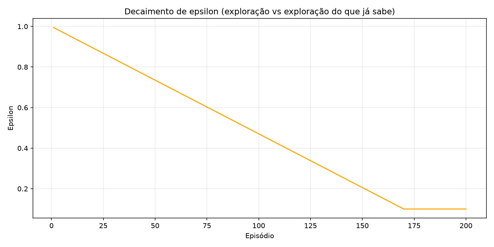
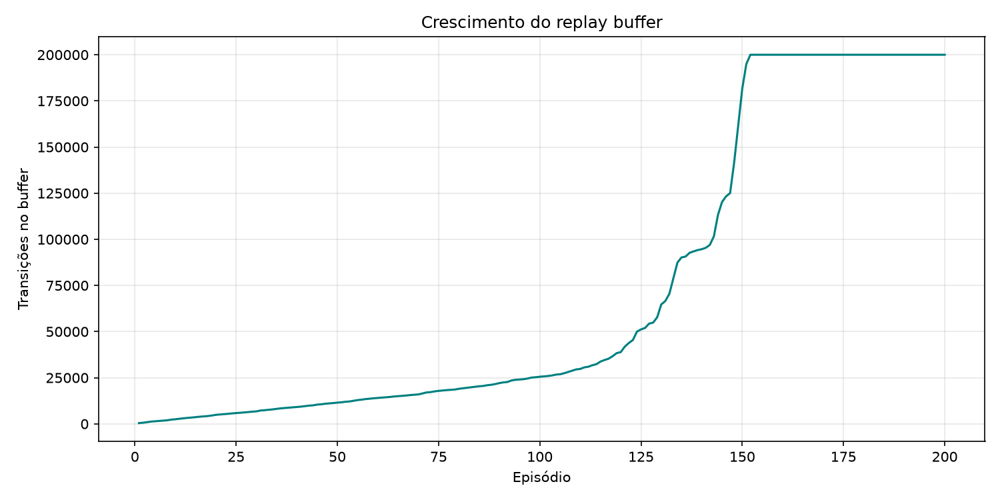
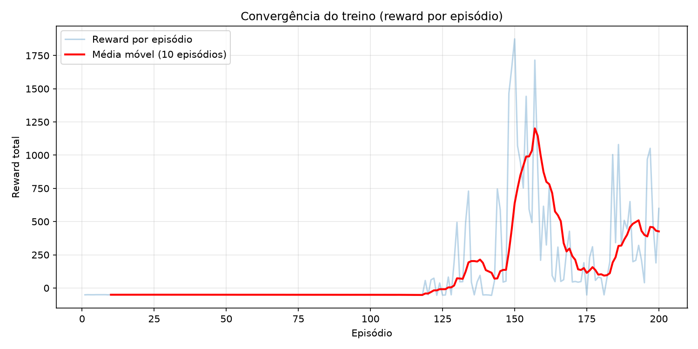
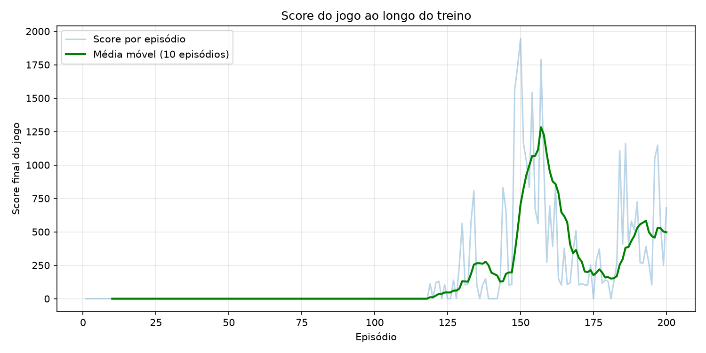
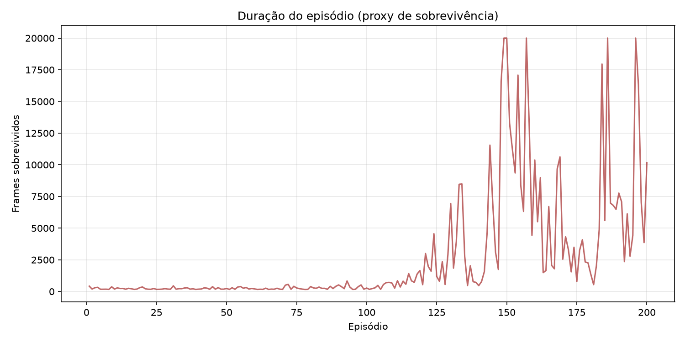
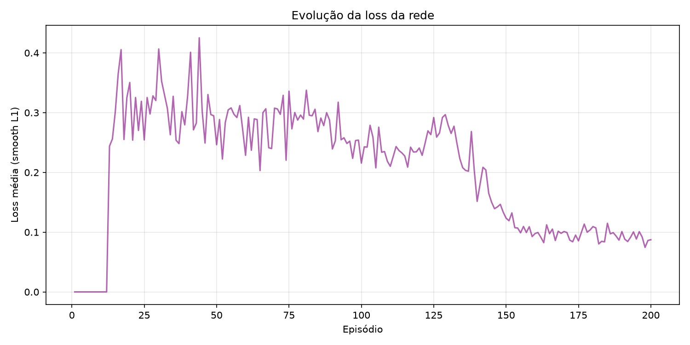
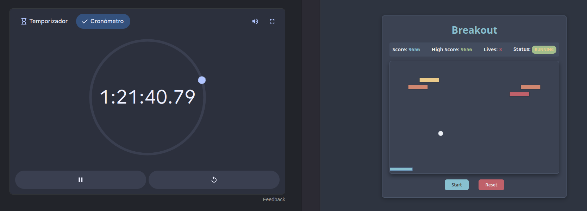

#  SI2 - Breakout

**Grupo:** 
- Nuno Loureiro - 130645
- Orlando Marinheiro - 114060

---

## 1. Descrição e Objetivos do Projeto

Este projeto consiste no desenvolvimento de um agente autónomo baseado em Reinforcement Learning (RL) para jogar o clássico jogo Breakout. O jogo decorre num espaço de coordenadas contínuo (600x400), onde uma bola ressalta nas paredes e numa raquete controlada pelo agente. O estado do jogo inclui a posição da bola, o seu raio e velocidade, a largura e posição da raquete, bem como a lista de tijolos ativos.

O grande objetivo é implementar um agente inteligente capaz de mover a raquete (OESTE/ESTE) para manter a bola em jogo, destruindo todas as colunas de tijolos e maximizando a pontuação final.

---

## 2. Instalação e Execução

### 2.1. Pré-requisitos e Instalação

1. É necessário ter o **Python 3.10+** instalado.

2. Criar e ativar o ambiente virtual:
  ```bash
  python3 -m venv venv
  source venv/bin/activate  # No Windows: venv\Scripts\activate
  ```
3. Instalar as dependências:
  ```bash
  pip install -r requirements.txt
  ```


### 2.2. Executar o Servidor e o Visualizador

Inicie o servidor backend (que também serve o frontend web):

```bash
python -m src.server.server

```

Abra o navegador e aceda a: `http://localhost:8765/`

### 2.3. Executar os Agentes

Num terminal separado (com o ambiente virtual ativado):

* **Agente DDQN (Agente desenvolvido)**:
```bash
python -m src.agents.ddqn.dqn_agent

```


* **Agente Dummy (Segue a bola de forma heurística)**:
```bash
python -m src.agents.dummy_agent

```


* **Agente Manual (Controlo pelo terminal via A/D)**:
```bash
python -m src.agents.manual_agent

```


### 2.4. Treinar um Novo Modelo

Para iniciar um novo treino de raiz usando a arquitetura DDQN:

```bash
python3 -m scripts.train_dqn

```
***Nota:*** Pode adicionar ```-h``` à frente para configurar os parametros de treino 

Para gerar os gráficos de avaliação após o treino:

```bash
python3 -m scripts.plot_graphs

```

---

## 3. Arquitetura da Solução

A solução desenvolvida utiliza o algoritmo **Double Deep Q-Network (DDQN)**. O DDQN foi escolhido por mitigar a sobrestimação dos valores Q (Q-values) típica do DQN tradicional, separando a seleção da ação da sua avaliação.

### 3.1. Representação do Estado

A representação do estado fornecida pela simulação foi transformada num vetor numérico contínuo para alimentar a rede neuronal. Por forma a otimizar a aprendizagem e reduzir a complexidade, o vetor `STATE_DIM` (tamanho 6) codifica estritamente as variáveis físicas essenciais:

* Posição (X) do centro da raquete.
* Posições (X, Y) da bola.
* Velocidades e direções vetoriais da bola (dx, dy).
* Distância relativa horizontal entre a bola e o centro da raquete.

*Nota: O agente demonstrou capacidade de inferir a necessidade de limpar as colunas de tijolos apenas pela física da bola, sem necessidade de receber a matriz de tijolos no estado.*

### 3.2. Modelo da Rede Neuronal (Q-Network)

A arquitetura base é uma rede neuronal Multilayer Perceptron (MLP) simples e eficiente, constituída por camadas lineares intercaladas por funções de ativação não-lineares (como ReLU). A rede recebe o vetor de estado como *input* e devolve os *Q-values* para cada ação possível no *output* (Mover Esquerda, Ficar Parado, Mover Direita).

### 3.3. Função de Recompensa

A função de recompensa (Reward Shaping) foi feita para acelerar a convergência e focar o agente na sobrevivência:

* **Recompensas Positivas:** Ganho pelo diferencial de `score` (sempre que a bola destrói um tijolo).
* **Penalizações Severas:** `-10` pontos por perder uma vida e `-20` pontos em caso de *Game Over*.
* **Shaping Contínuo:** Uma leve penalização baseada no diferencial das coordenadas a cada frame (`-0.01`). Este ligeiro decaimento força o agente a procurar a recompensa ativamente, evitando que fique parado indefinidamente sem resolver o jogo.

### 3.4. Hiperparâmetros

* **Learning Rate:** `5e-4` (Adam Optimizer)
* **Gamma (Fator de Desconto):** `0.99`
* **Batch Size:** `64`
* **Buffer Size (Replay Memory):** `200000`
* **Tau (Soft Update da Target Net):** `0.005`
* **Epsilon:** Decaimento linear de `1.0` para `0.1` ao longo de 170 episódios.

---

## 4. Avaliação e Análise de Performance

O modelo foi treinado ao longo de 200 episódios. Abaixo encontra-se a análise das métricas extraídas durante o treino.

### 4.1. Decaimento de Epsilon e Buffer

O agente seguiu uma estratégia de *epsilon-greedy*. Como demonstra o gráfico do epsilon, a exploração foi decrescendo progressivamente, estabilizando no seu limite mínimo de 0.1 no episódio 170, focando-se a partir daí na *exploração do que já sabe* (exploitation). Em simultâneo, o Replay Buffer acumulou as experiências, esgotando a sua capacidade máxima de 200.000 transições por volta do episódio 150.

<p align="center">
  
  
</p>

### 4.2. Convergência e Score por Episódio

O treino apresenta um ponto de viragem notável por volta do **episódio 125**. Até esse ponto, as recompensas e pontuações do agente mantiveram-se quase nulas devido à aleatoriedade das ações. A partir do episódio 130-140, a aprendizagem estabiliza e o agente começa a atingir pontuações mais altas, com o `Reward total` e o `Score` a fazerem trajetórias idênticas, terminando em picos com perto de 2000 pontos.

<p align="center">
  
  
</p>

### 4.3. Duração da Sobrevivência e Loss

Com o aumento de pontuação, ocorreu também um aumento substancial do número de *frames* sobrevividos, com o agente a atingir repetidamente o limite máximo de segurança imposto por código de `20000` passos. A *Loss* (Smooth L1) apresenta o formato clássico no Deep Q-Learning: um aumento drástico inicial conforme a rede tenta acomodar grandes recompensas no buffer, seguido de um declive gradual à medida que os *targets* de Q-value estabilizam, terminando em valores de perda residuais (≈0.1).

<p align="center">
  
  
</p>

### 4.4. Teste do modelo desenvolvido

O agente final obteve uma boa performance. Num teste de resistência sem limite de episódios (como demonstra a captura de ecrã abaixo), o agente conseguiu jogar de forma ininterrupta durante **mais de 1 hora e 21 minutos**, acumulando um `Score` superior a **9650 pontos** sem perder uma única vida.

<p align="center">
  
</p>

---

## 5. Trabalho Futuro

Durante a análise de performance, observou-se que o comportamento atual do agente é predominantemente **passivo e defensivo**. Devido à pesada penalização imposta pela perda de vidas e pelo *Game Over*, o modelo otimizou a sua política para garantir a sobrevivência a longo prazo (manter a bola em jogo), acabando por destruir os tijolos de forma reativa e circunstancial.

Para tornar o agente mais **agressivo, ofensivo e eficiente**, propõem-se as seguintes melhorias para trabalho futuro:

* **Reintrodução da Matriz de Tijolos no Estado:** Expandir o vetor de estado (`STATE_DIM`) para incluir a informação exata dos tijolos que ainda faltam partir (ex: um vetor binário de blocos ativos). Isto daria à rede neuronal a capacidade de "ver" os alvos e aprender ângulos de ressalto para direcionar a bola ativamente para as zonas com mais tijolos.
* **Ajuste do *Reward Shaping*:** Afinar a função de recompensa para incentivar a rapidez. Poderia ser introduzida uma pequena penalização por tempo (para forçar o agente a limpar o ecrã mais rápido) ou um multiplicador de recompensa (para recompensar *combos* de tijolos partidos num curto espaço de tempo).
